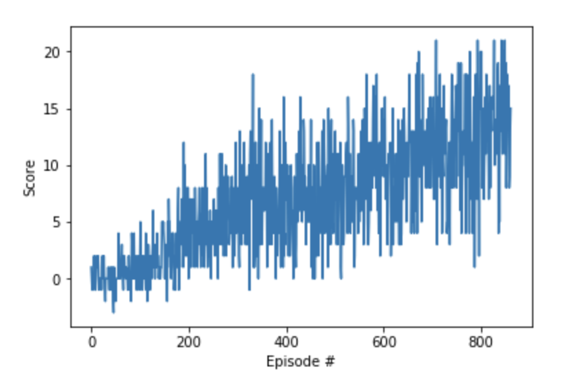

# Banana Navigation

## Table of Contents  

[Algorithm](#First)

[Hyperparameters](#Hyperparameters)

[Rewards](#Rewards)

[Future Work](#Future_Work)  

## Algorithm

We have used DQN model, which is built with Linear Layers and Relu activation functions. The network has been built using 4 Layers of size 256 each proved to perform the best.

## Hyperparameters:
* Buffer Size = 100000
* Batch Size = 64
* Discount Factor (GAMMA)  = 0.999
* TAU (for soft update of target parameters) = 0.001
* Learning Rate = 0.0005
* Update Network every 4 step

## Rewards
We have trained the Agent using the DQN, as input we have used the vector of state instead of an image so convolutional neural network is replaced with the next layers:

Fully connected layer - input: 37 (state size) output: 128
Fully connected layer - input: 128 output 64
Fully connected layer - input: 64 output: (action size)

We can observe the evolution of the reward along of the episodes. Below is the graphic:

## Future Work
Reinforcement Learning has proven its worth in approximating real-world environments. It can help solve many problems that and with the combination of deep learning and RL, we’re much closer to solving these problems. We have thought in the next steps to improve our algorithm:

  1. Try with another hyperparameters

  2. Train the double deep Q Network

  3. Train the dueling deep Q Network

  4. Develop an algorithm to learn from pixels

Future applications of reinforcement learning include some of the following tasks:

* A Distributional Perspective on Reinforcement Learning [arxiv](https://arxiv.org/pdf/1707.06887.pdf)
* Rainbow: Combining Improvements in Deep Reinforcement Learning [arxiv](https://arxiv.org/abs/1710.02298)
* Hierarchical Deep Reinforcement Learning [arxiv](https://arxiv.org/abs/1604.06057)
